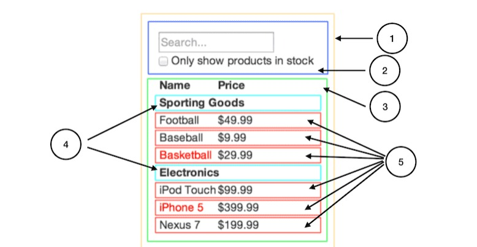

# Think like react

## how data flow in react

Remember that data flow from parent to children top to bottom.

1 parent section
2 filter controller
3 children section
4 list item category
5 list item

- look at parent section (no.1) the parent is the main body of this component it's sole purpose is to fetch data to API and pass down the data to children section to be rendered.

- filter controller (no.2) it's job is to control what data the parent should get and how to serve it

- children section (no.3) it's job is to map the data it get's from the parent and rendered the data with format of list item category (no.4) and list item (no.5)

- list item category (no.4) static renderer

- list item (no.5) conditional renderer

now if we look at the whole components we can conclude that each component have their own task and purposes hence the single responsibility principle implemented in this context.

## Now can we implement this principle to our project?

Of course we can. If we want our project to scale and maintained well, we should have implemented this way of thinking.

## Why is that?

Let's say that we are private house contractor for a developer company. When we build a house and furnished the house, we want to build the house with the design that we can reuse over and over again and furnished the house with the same type of funiture to fasten our work and optimized resource used to build the house. Imagine that if we get task to build 100 house and each house have different design different furnished, how long will it takes to build it? How complex it will be?

React does the same thing, if we rebuild each component that we are going to use without thinking about the reusability of the component, it will only make our work harder and take longer to debug. Our time is limited so please be mindful of that.

although not all component can be reuse, it is still best practice to make our component small and be able to reuse

### if you are not convince with words how about mathematics.

single use component without reusability = O(n^2) time complexity (why? because each component is unique hench cannot be reuse even if it has the same purpose with other feature)

reusable component = O(log n) time complexity (why? Though the component that we are going to make is harder to make at first, but it will be able to be reuse in different part of our websites, for example the each pagination section can be reuse in CMS, E-commerce, and in User Transaction. Carousel in the main page can be reuse for the carousel in the product detail. The list goes on)